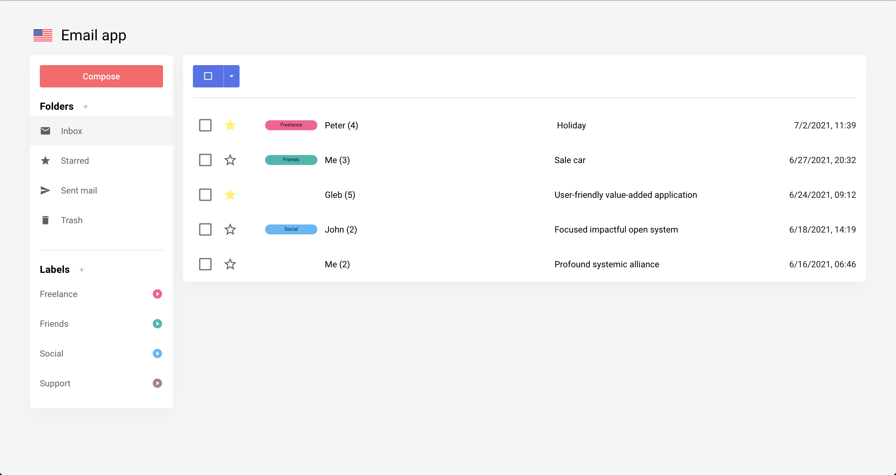

# Email app
## [Демо](https://email-app-jet.vercel.app/)

Прототип email клиента. Основной особенностью является отображение писем в виде чата, только в порядке привычном для email писем (вверху последнеее сообщения). Имеет функционал мультиязычности (английский и русский языки).

[](https://vimeo.com/572054421)


## Технологии
  - Vue 3 (Composition API)
  - Vue-router 4
  - Vuex 4
  - [Quasar 2](https://next.quasar.dev/)
  - TypeScript

## Хостинг
Автоматический деплой после push на [Vercel](https://vercel.com)

## Функционал
- Переключение языков
- Написание письма
- Создание папки
- Удаление пользовательской папки
- Редактирование пользовательской папки
- Создание лейбла
- Удаление лейбла
- Редактирование лейбла
- Групповое выделение:
  - Все
  - Ни одного
  - С пометкой
  - Без пометки
  - Прочитанные
  - Не прочитанные
- Действия над цепочками писем:
  - Перемещение в другую папку
  - Добавление/удаление лейбла
  - Отметить как важное/снять отметку
  - Удаление
  - Отменить как прочитано/не прочитано

<br>

## Разворачивание проекта

### Установка зависимостей
```bash
npm install
```

### Старт приложения в development node (hot-code reloading, error reporting, etc.)
```bash
quasar dev
```

### Линтинг файлов
```bash
npm run lint
```

### Сборка приложения
```bash
quasar build
```
